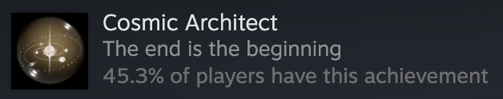

很多人用《Inside》同一设计师来安利《Cocoon》，很可惜我没打过《Inside》；但是打完《Cocoon》，我倒是有点想去打开《Inside》了。

## 我喜欢的部分

我心水的一个点是《Cocoon》是简单的。也不是说《Cocoon》的解谜难度低，相反本作通过简单的组合就达到了很多耐人寻味的关卡设计，但是游玩的感受是不困难的，每个解谜的方法都草蛇灰线，藏在一路上的各种行动中，如果连着打，几乎不会遇到卡死的那种卡关。不过如果断断续续打的话，会卡关也说不定呢（四小时的体量，一次性打完吧）。

我猜想设计师最花心思的地方是怎么在游戏里体现嵌套的概念：四种颜色的道具球本身的功能并不算很巧妙的设计，但是如何在嵌套的情况下组合使用这些功能是很有意思的，这些组合甚至也包括对地形里的设置的组合；当然，主要是还是绿球和白球的组合，如果可以更加深挖其他组合方式也是不错的。在打最后两章的时候，我最开始差点误以为出现了绿球红球你中有我我中有你的矛盾，还好设计师不是什么混沌邪恶派。最终的谜题也是对嵌套的注解，可见这是设计师最在意的主题。我认为通过谜题设计来体现设计师想表达的哲学才是正道；那些在背景、文字、甚至是配乐里聊哲学的作品，也不是每一部都能成为《Disco Elysium》啊！

画面自然是赏心悦目的，这个年头感觉美工不出众的独立游戏已经活不下去了。前几天有人给我安利新番Scavengers Reign，暂时只看了第一集，恍惚觉得画风有点相似，都有一种？天地不仁的美。可惜我打的时候静音了，不知道配乐水平如何。

## 槽点

设计师有意将本作设定为纯粹的解谜游戏，抛弃了所有的动作元素，控制只有上下左右和操作键，但是！为了提升boss战相比于其他解谜环节的操作难度，很多boss战的设计实际上都大幅削弱了角色的行动能力，以严格满足只有五个控制键的先决条件。虽然也有让人想到劫的技能，以及浮空的元素，但是boss战的操作快感确实很低...

另一个槽点是，本作有个会飞的探照灯的设定，围绕怎么带着探照灯赶路有很多巧妙的谜题设计，但是每次获取探照灯本身的谜题是找到一个23456的排列顺序：这个谜题在本作中一以贯之地是一个纯考验眼力的东西，这对于我这个眼力极差的人来说非常不友好。通关之后了解了一下大家都在哪里卡关，发现我在大家经常卡关的地方意外地和设计师脑电波很一致，只有每次考验眼力都疯狂卡关。关键是，即便我意识到了游戏进展到了这些地方就是考验眼力，我仍可以对图案视而不见，非但如此，我还会臆测图案是不是藏在什么奇怪的组合里，最后都证明是想多了。

其他人的测评中常提到的一个槽点是，游戏里有的时候赶路很烦（全凭双腿，但是为什么昆虫双腿赶路），而且进行了不正确的尝试之后需要反复赶路。但是仔细观察可以发现，游戏里几乎没有多余的路、冗余的设施，也很少设计迷惑选项，我认为赶路的问题是设计师为了保持地图的线性和减少学习成本（毕竟本作没有引导嘛）有意为之，玩久了感觉成为了游戏风格的一部分。

## 结语

12月的开始打了《Cocoon》，直接成为我的2023年度解谜类游戏，不过23年我根本也没打其他解谜类！那就祝福出品工作室能顺利活下去，让我打到它的下一部解谜作品。

