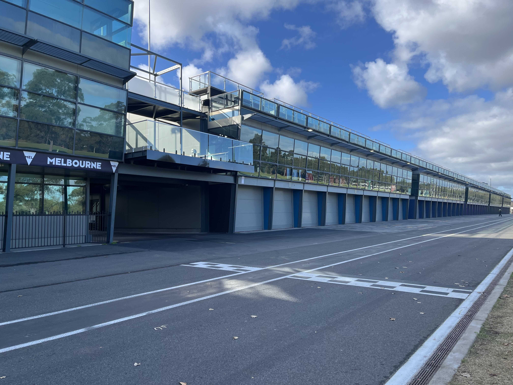

Given that I probably won't pursue another PhD degree, AUS could be one of my last graduation trips.

By the time I write these words, more than six months had already passes since the trip ended.
Recalling the winter life in the southern hemisphere while in the northern winter feels like a crow digging up its hidden food during the coldest months.

## Sydney

### Sydney Opera House

The house looks completely different from every angle.
An interesting fact is that, the view from the main entrance might be its least impressive angle.
The house looks much better from the ocean.
It's fair enough to say when the architect designed the house, he was already imaging it within the Sydney coastline.



The royal botanic garden is right next to the opera house and is a fantastic spot to enjoy the harbour view.
But my favourite memory is how perfect the grass is for a nap -- especially for a traverler who just stepped off a ten-plus-hour flight to Sydney.

### Sydney Fish Market

Sydney fish market is a prime location for tourists to get robbed by the local Australian birds.
There might actually be more birds than fish at the market.

Australian white ibis has long legs and slender beak which make it surprisingly ideal for the job of waste sorting.



The local Sydney rock oysters were a bit of a letdown.
But a more important takeaway is still this: do not eat fish outdoors, unless someone is looking to get robbed by seagulls.
We bought a whole box of salmon and didn't even get to taste a single slice😢.
They are professional bandits!

### Taronga Zoo

While the streets of Sydney are practically a paradise for wild animals, we can still find plenty of unique animals at the zoo.





The best-kept secret about Taronga zoo is that it's actually the premier spot for viewing the Sydney coastline.



### Whale Watch

~~Speedboating~~ Whale watching is absolutely the best!
Especially when the waves are super big🌊.

During the Southern Hemisphere winter, whales migrate from south to north along Australia's east coast.
On our first day in Sydney, we were so excited to go whale watching, but the captain warned us it was going to be a rough day at sea.
We only caught a distant glimpse of two whales that day.
Captain scouted the vast ocean for whales that clearly didn't want to be found.
It felt as though the captain was ready to just keep sailing all the way to Antarctica.

Although we barely saw any whales on the first day, we did get a solid few hours of high-speed boating.
Pure fun - more intense than a roller coaster.
Thankfully, we got a complimentary voucher for another trip since we didn't spot enough whales.

The conditions were much gentler for out second trip out to sea, allowing us to get close look at the whales.
Right before a deep dive, whales perform one last breach and their tails rise high out of the water.
These tails are just like fingerprints, which can be used by researchers to identify and document individual whales:



Besides chasing whales, we were lucky enough to be chased by dolphins!
A large group of dolphins were jumping and frolicking around our small boat.
We met some real-life siren:



### Bondi Beach

Sydney is a city of beaches. 
Sandy beaches can be found everywhere.

Beach volleyball seems appealing, but beach softball is even better.



## Cairns

Cairns feels just like one of those tropical resort towns you could see in a Netflix series.

The airport is a small-town airport. Love the baggage carousels:



### Great Barrier Reef

A miraculous coral world awaits beneath the waves of the great barrier reef.
My words can never possibly capture it - it's better to go watch a documentary about the Great Barrier Reef.

Snorkeling around the coral was my favourite part of the entire journey.
It's just a shame that no one can capture a dream within a photograph.
(I even swam with a sea turtle - you can't tell me that wasn't a dream.)

### Kuranda

In the Kuranda rainforest, we experienced the traditional hunting techniques by learning how to throw a boomerang.
It made me realize that if someone had to rely on a boomerang for hunting, that poor guy would almost certainly starve to death.



We also tasted sausages made from emu and kangaroo meat.
The sausages didn't taste all that unique.
Perhaps they had a slight gamey flavour.
We took train uphill and returned via the cable car.
There were towering trees and a majestic waterfall in the mountain valleys.
I was really worried because I heard stories about Taipan snakes.

## Melbourne

Melbourne university is good😆.

### Albert Park Circuit

Melbourne really gets sports fans hyped.
When I watched the Australian grand prix online, I admired the scenic beauty of the track.
I finally visited the Albert Park Circuit (with race facilities removed).
I walked along the track, looking for lingering traces of grand prix.

|The Finish Line|The Pits|
|:-:|:-:|
|||

Plus, the circuit serves as an exceptional vantage point fot admiring the Melbourne skyline:



### Puffing Billy Steam Train

We rode a real steam train -  a genuine steam locomotive, not one of those fake amusement-park trains that just puff out white smoke!



The little train trolled through the temperate rainforest, with tall, straight trees towering alongside the rail.
We sat on the window frames, pretending we were new loggers.

It seemed like this route only runs a single train, and somehow we still managed to depart late.
While we were sitting in the carriage waiting to leave, colorful parrots flew past.
I tried to lure them over with some fries ... and ended up getting mugged by a laughing kookaburra instead.
That bird is definitely a raptor -- the impact of its swoop scared me so badly to drop the fries.
The smug predator:



⚠️ a reminder: I was wrong - don't feed wild animals.

### Phillip Island

Phillip Island is a great place to watch little blue penguins come back home.
Little penguins spend the whole day out at sea making a living, and only after sunset do they waddle up from the shore and head back to nests.

Little penguins came ashore in groups, riding the waves onto the beach.
Some of the penguins that made it ashore first even went back into the sea to wait with other penguins for the next big wave.
The cold wind and crashing waves really said how harsh and unforgiving nature can be.





### Great Ocean Road

Winter isn't the ideal time to visit the Great Ocean Road.
Inside the relentless winds and heavy mist, the landmarks of road were barely visible:



The rain started and stopped repeatedly, rewarding us with rainbows everywhere.
This one was a perfect formed full rainbow:



Bonus: I feel like this lighthouse monster and I are twins.

