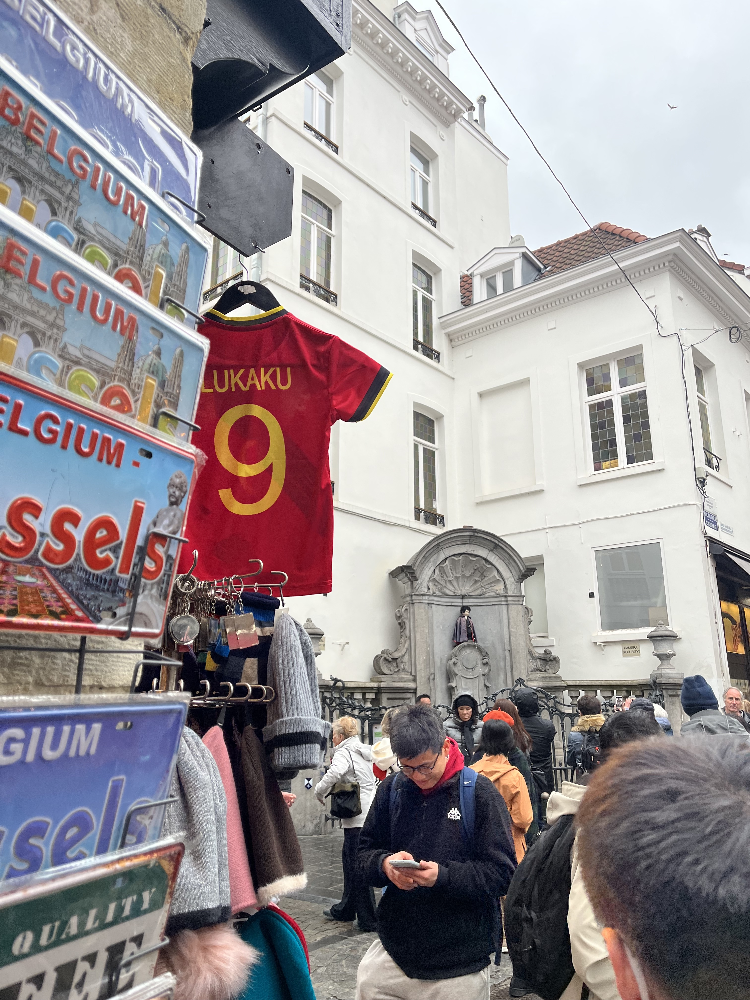
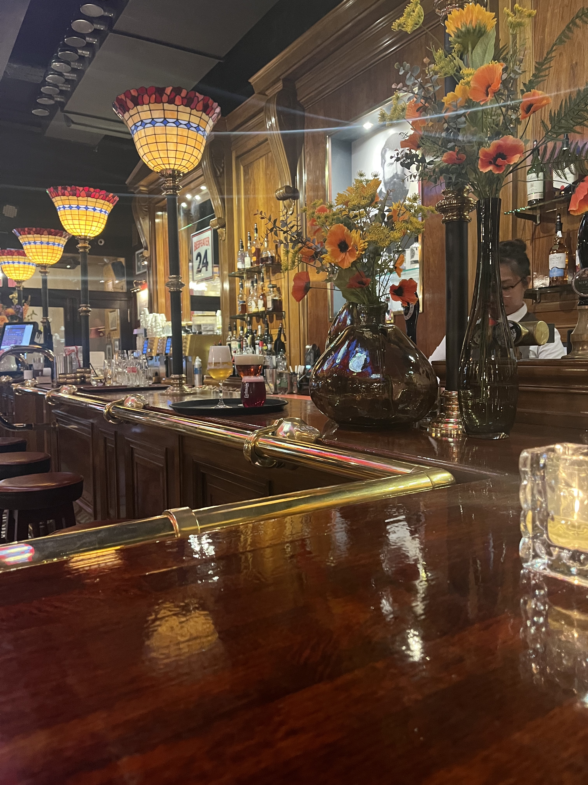
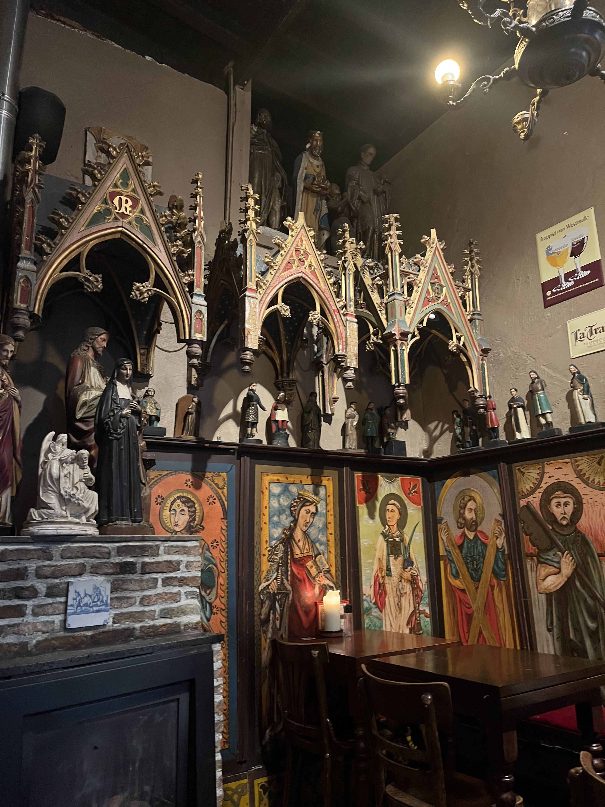
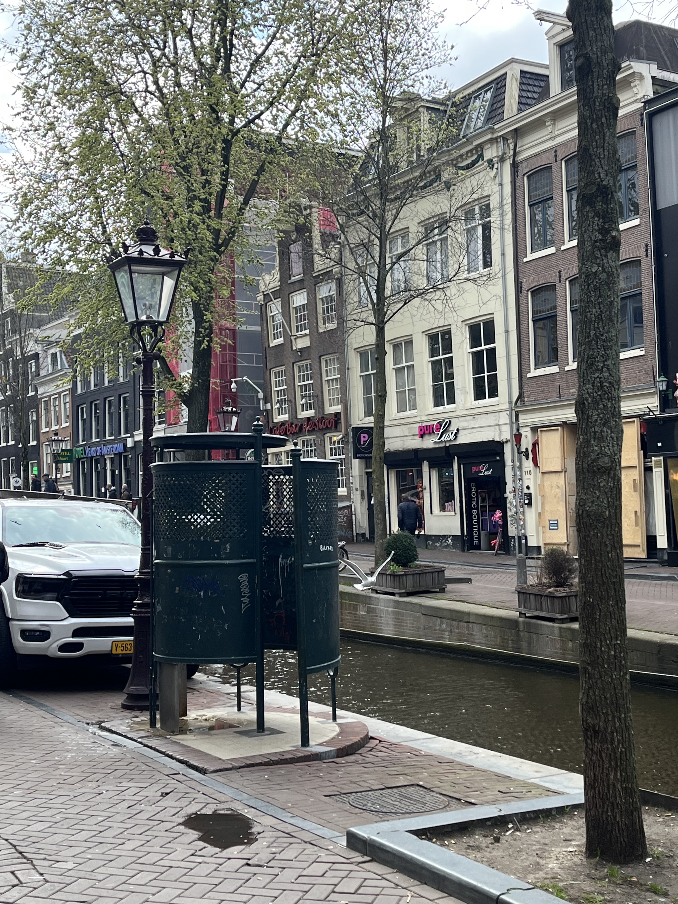

### Bruxelles

We landed in Bruxelles.

Manneken Pis, the most famous landmark in Bruxelles:

We were not able to see the classic bronze skin.
He was dressed in Easter Day attire.
The most interesting part is that the souvenir shop nearby was selling Lukaku's jersey.

I enjoyed waffles at its birthplace.
The menu was in French and I wanted to order the "Trois Chocolats" (which means three kinds of chocolates) waffles.
To practice my French, I decided to order in French.
My French speaking successfully confused the waiter to the point that he switched to English to communicate😢.

### Antwerpen 

Museum Aande Stroom (MAS) is located on the banks of the Scheldt River:

There were many strange and funny exhibits:

Some exhibits there were only introduced in Dutch.
I could barely understand partial descriptions if there were French versions.

Antwerp has many beautiful restaurants.

A bar with retro style:

A restaurant serving traditional Antwerp food:

Although the restaurants are cute, they did not satisfy my craving for Chinese cuisine.

### Amsterdam

On the train from Antwerp to Amsterdam, I saw many beautiful windmills.
Not sure if they were still in use.
A little incident occurred as the train was delayed.
I mistakenly boarded the previous train, which causes a loss of 85 euros😢.

Thanks Yixian Shen for his delicious laoganma noodles!
Exactly the comfort food for a Chinese guy (especially a guy who had been eating western food for days).

The city center is filled with canals everywhere.
Very beautiful.

This is a combination of toilet and urinal:

I met this installation in the Red Light District.
Culture shock😆!
(I stand against human trafficking.)
