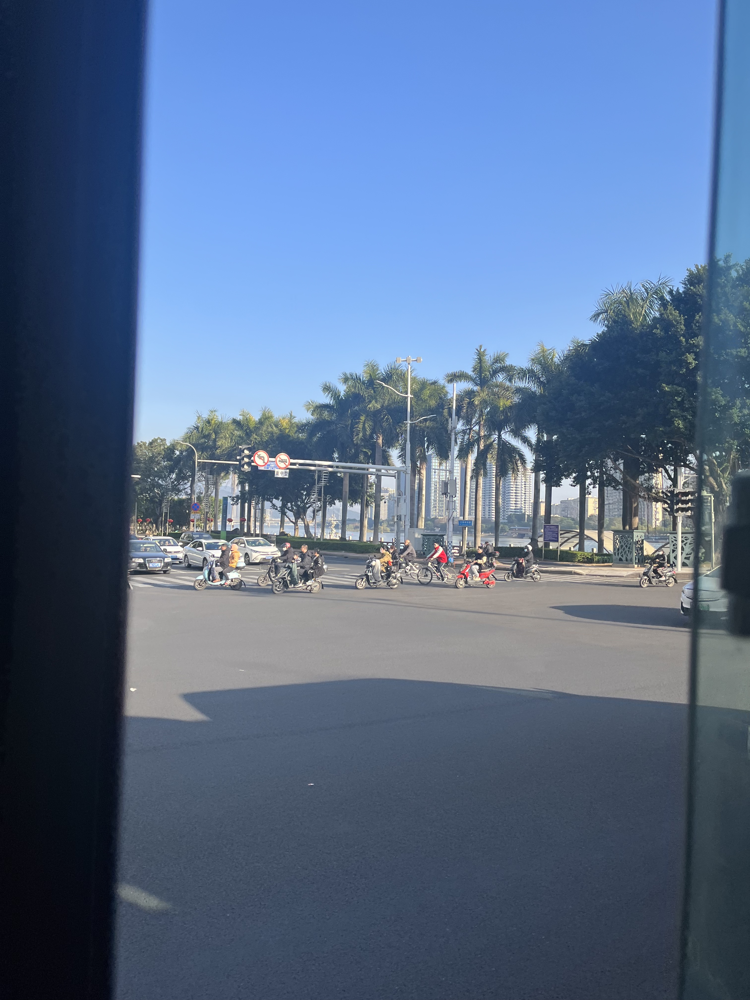
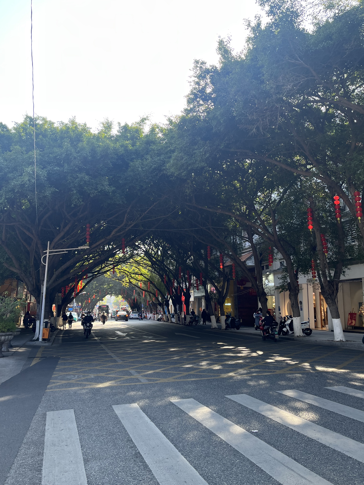
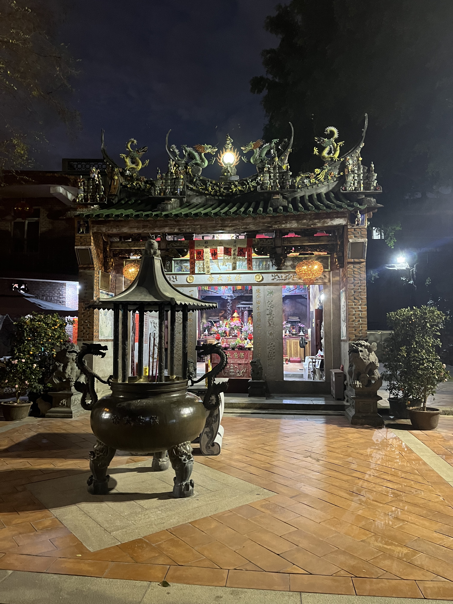
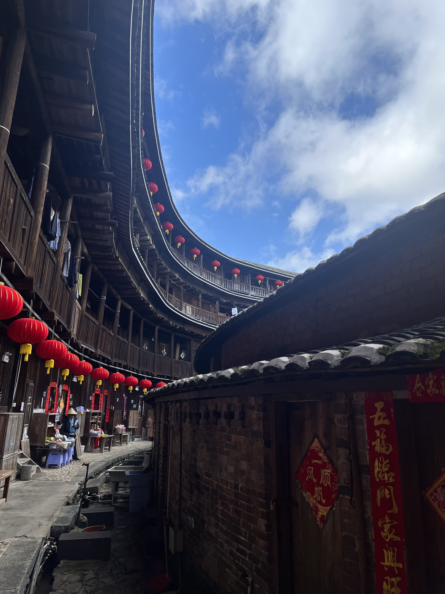

从北到南游历福建。

在武夷山既没有喝上大红袍也没有喝上正山小种，叹气。
武夷山的水应当在名山中首屈一指吧：

但是太阳落山之后坐竹筏也太冻人了！

福州，公交车上拍闽江：

福州的行道树都很美丽。

泉州的街道，难得的清净：

大年初九，到处都在做法事。开元寺人挤人。关岳庙更是赶超北京早高峰地铁。

鼓浪屿上的24h便利寺庙：

晚上从鼓浪屿坐公交船回厦门，夜景很美丽。

龙岩，客家土楼：

因为不能上楼，建议去游玩的时候结合网上图片自行想象。不过目前最大的土楼里还有两百余人生活，真是非常神奇。
