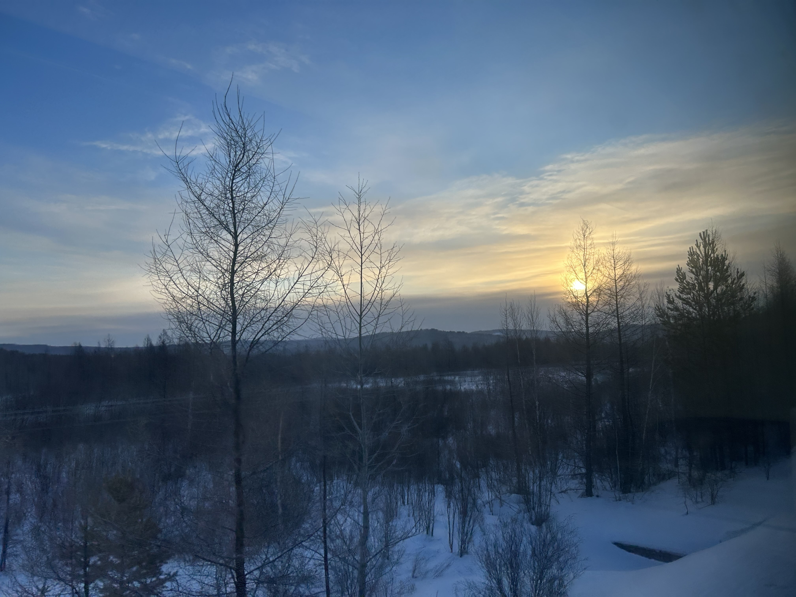

在2024剩下不到8小时的时候，临时决定去一趟漠河，兑现吹出去的牛皮。
感谢逗酚，这都能和我一拍即合。

本来想在0点整的时候纪念一下这难得的飞机跨年，结果high聊回过神来已经过了20多分钟了！

## 哈尔滨

落地哈尔滨，疑似太平机场当晚最晚的航班，在机场滴滴和高德都打不到车，最后只能上了黑车去市区。。。
很好，2025的第一天就久违地坐了黑车。

2025的第一天睡到热醒，第一顿饭吃了夸张菜量的东北家常菜。
慢悠悠地晃到冰雪大世界，已经中午。

冰雪大世界对没看过冰雕的人，第一眼的冲击足够的大。
日光，照在园区，一瞬间以为这里是切尔诺贝利：

最好笑的是在冰雪大世界看到了天坛祈年殿，疯狂合照，在哈尔滨寻找北京是怎么回事？！

南方人在这里贡献了艺术照情头（逗酚断言这将是引领潮流的拍照方式）：

|||
|:-:|:-:|
|||

夜晚亮灯的冰雪大世界疑似某种迪士尼（声明：我没去过任何迪士尼乐园）：

最后是天空上的无人机表演让我惊觉，是元旦呀（怎么2025才过去不到24个小时就忘记了😓）：

齐齐哈尔烤肉好吃。
写到这里的时候在质疑自己为什么不去齐齐哈尔了...

熙熙攘攘的圣索菲亚大教堂和中央大街还有松花江...
坐了松花江索道去了对面什么太阳岛，结果被莫名其妙的封路害得差点没赶上去漠河的火车，这一段我可以吐槽一个小时但是此处略过...

## 漠河

很幸运地改签到了雪国列车。
虽然是很幸运，但也是18个小时的卧铺...

在哈尔滨站上车前，去车站的便利店里买点零食。
转了好几圈，买了花生米，小鱼仔和黄瓜，结账的时候店员一脸不爽的表情。
走出到店门口，福至心灵，转回去买了两罐啤酒，店员一脸“舒服了”的表情，直接锐评我们终于想起来了...

卧铺车摇摇晃晃，有一种回到童年的错觉。

窗外的景色，不愧是雪国列车嘛。

|乡村|林海雪原|
|||

这班车哪哪都好（甚至餐车早上提供饺子），就是这个床铺上的装饰画，只能说是有点cult：

十分生草地在18小时的列车上随机组了两个陌生人一起在漠河拼车。
感想是不如自己double花费。

直奔驯鹿园。
感觉比动物园可能更残忍。
这里的驯鹿被驯化成，只要看到人手上有篮子就向人拱过去...

司机师傅开着开着忽然说，路边就是黑龙江：

阳光照在白桦林上：

黑龙江的大湾（这可是顶着风雪爬山到睫毛都冻上了才拍到的）：

## 后记

漠河的旅行对我来说甚至是有点魔幻的：住在大炕上，体验了泼水成冰，吃了铁锅炖，在各种极点、界碑、最北点拍照，陷进比膝盖高的雪里，在零下四十度爬山...
虽然很想好好的记录，但是根本没有办法掏出手来拍照。
每次从室外回到室内，完全就是呆头鹅状态。
和逗酚呆头鹅对坐的时候，不禁感慨，这里的人们是怎么工作学习生活的呢...
