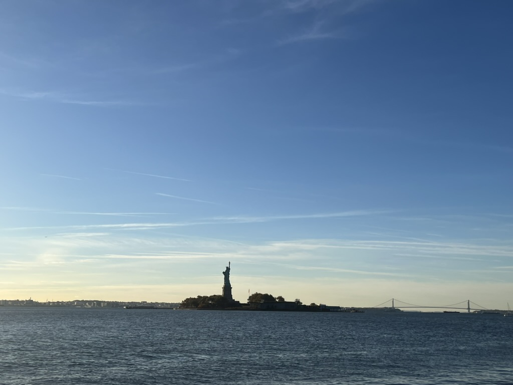

It's very rare for ICCAD to be held in New Jersey.

## The first night

The flight over 17 hours has already exhausted me.
However, the queue at JFK immigration service was even more horrible😱.
After a long long long journey, I finally arrived at the conference hotel.
I didn't expect that the most frustrating thing was waiting for me.
The hotel could not confirm my reservation.
I was arguing with the service provider while enduring the headache after an extra-long flight.
I almost became homeless at 3 a.m. in Newark.

Not over yet.
The worst part is when I was lying in bed at 4 a.m. and I knew I had to get up at 8 a.m. to participate in some competition.

## Broadway

Thanks ICCAD for inviting us to enjoy *The Lion King*.

Before the show started, I spent some time walking around Times Square.
Dazzling signs, crowded crowds, and the smell of seeds; this place is really New York.

Although I was already familiar with the story of *The Lion King*, the show was totally new to me.
The exaggerated stage effects made me feel like I was in the grassland.
But if I had a choice, I would rather watch the original Hamlet😂.

|Theatre|Inside|
|:-:|:-:|
|||

In fact, the most exciting thing was that the Dodgers vs Yankees world series was being played at Yankee Stadium in the same city.
I didn't get a ticket so I could only watch the games every night on TV.

## Halloween

I had a wonderful time at *The Met*.
I took too many photos.
But everyone still have to visit museum in person.

|*The Met*| *exhibit* |
|:-:|:-:|
|||
|||

Central Park is adjacent to *The Met*.
If it were not winter, I would like to have a picnic.

Streets were full of Halloween deco.
But I chose to eat Asian food every meal😆.
So not much Halloween atmosphere.

And I really love the sunset at the High Line and the night view of the Brooklyn Bridge:

| Sunset at High Line | Night view of Brooklyn Bridge |
| :-: | :-: |
| ||

I'm grateful for the hospitality from my friends at high school.
A great dinner!

## Princeton

Thanks Xinchun for showing me around Princeton.
A beautiful town and a beautiful campus.

Department of Physics:

|The wall of Nobel Prize laureates|Library (with board games)|
|:-:|:-:|
|||

(Actually the Nobel Prize in Physics 2024 had just been awarded to the AI field, which was a very controversial result...)

I also took a walk to the Institute for Advanced Study.
The environment is so quiet.
I sat quietly for a while beside the famous small lake.

||||
|:-:|:-:|:-:|
||||
||||

## Leaving day

A glimpse of *the Statue of Liberty*:

|*the Statue of Liberty* at dawn | *Manhattan* |
|:-:|:-:|
|||
