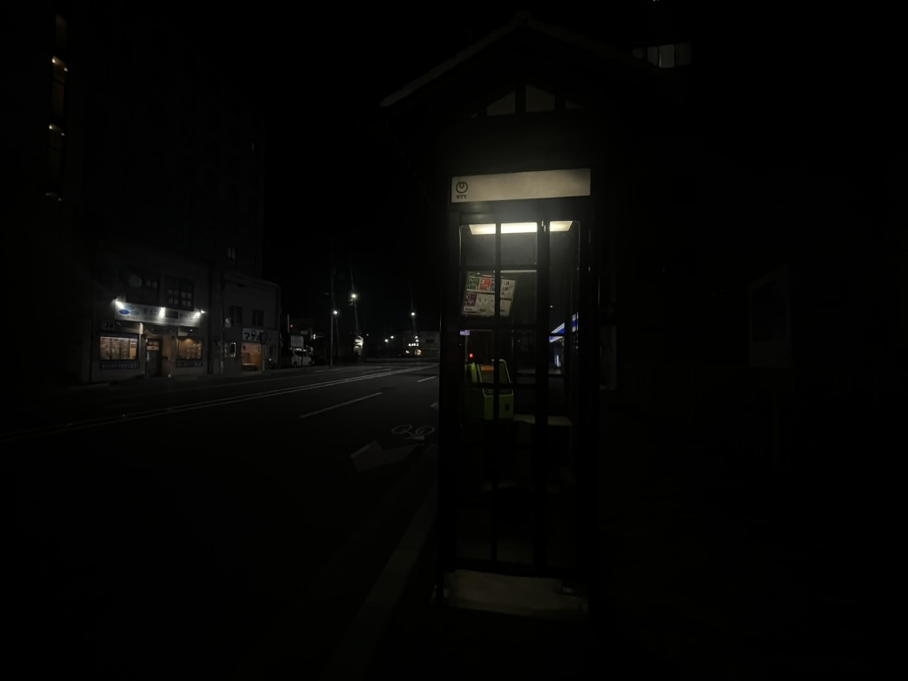
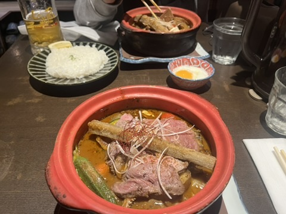
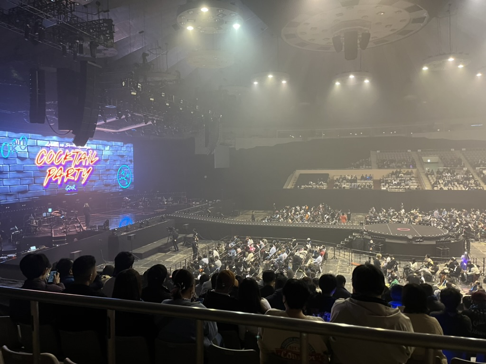
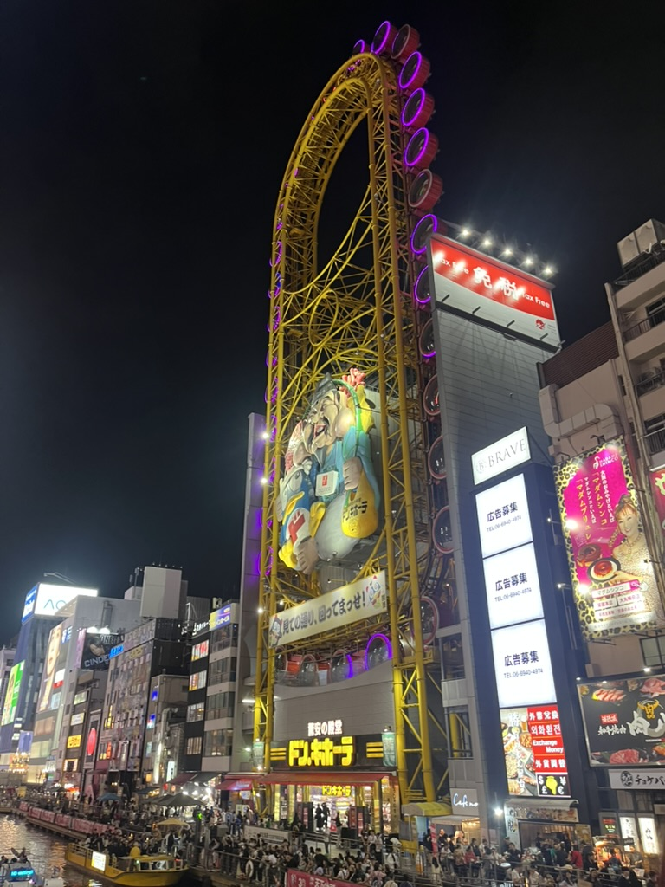
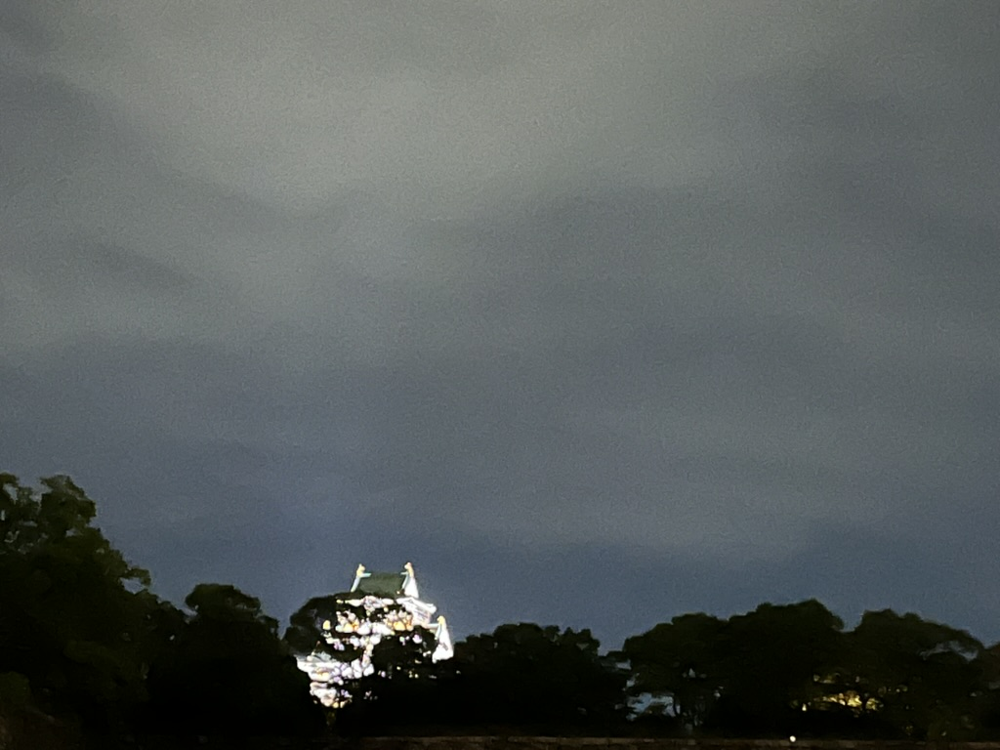

致谢：许老师的日语导游！许老师的日语电动滑板车交规代考！

## 京都

虽然往后每一天的火车都无比准时，但第一天落地关西机场到京都的Haruka，居然就神奇地晚点了！！
京都也是意料之中的没有夜生活，晚上不吃便利店就只有居酒屋啦。
路灯，售货机，和停车场招牌的光，这就是京都的夜晚了。

说到京都果然是金阁寺。
感谢三岛由纪夫病态的告诫，金阁寺不是美的化身。
阳光下金光闪闪的金阁寺，没有美丽到惹人产生毁灭的冲动，真是松了一口气。

游览完金阁寺还可以喝抹茶（疑似是许老师最爱的轻音少女没喝上的），以及贴金箔的抹茶冰淇淋，nice！

虽然我还没去过中国铁道博物馆（2025必去），但已经去过京都铁道博物馆了。
在这里可以模拟驾驶（没有体验），蒸汽机车（没有体验），以及看到帅气的扇形车库（请自行感受）！

| 扇形车库 | 蒸汽机车 |
|:-:|:-:|
|||

铁道博物馆不远处就是水族馆。
遇到了京都大学的研究员在人眼人手记录海豹的行为，问为什么不用传感器，解答说是因为海豹太滑了贴不稳以及传感器会让海豹不安，感觉不够embodied ai。
结果我也人眼记录了一下企鹅捡石头。
现在去做企鹅捡石头视频的youtuber还能火起来吗，说不定能称霸解压区。
所以南极是有石头的吗，还是其实是马达加斯加的石头？

天黑透了才到达鸭川，水位很低，河中间到处都是杂草丛生的浅滩，好像也没有那么适合漫步。
看来还是春宵苦短或四叠半的画风比较适合鸭川。

路边的神社，希望全人类都幸福：

夜晚的祇园全然不灯红酒绿。
本以为花街应是夹道丝竹管弦，没想到净是会员制茶屋，竹帘外小路上阒然无声。
清水寺的舞殿也好不寂寞。

本日最佳绝对是旅馆里的vod卡片贩售。
总之如果在日本住宿，打开电视看到vod的选项，请务必浏览目录。
1000日元的vod卡片最后看了日配的*Final Cut*，然而本片实际上是日语电影*摄影机不要停!*的法语翻拍版。
居然之前正好没有看过*摄影机不要停!*，该片正是适合我这种又懂（不懂）法语又懂（更是完全不懂）日语的观众。
我很喜欢。

## 宇治

前往宇治的路上还下车去巡礼了京都动画总部。
看到了重建的黄色小楼，希望一切都好。

宇治的名产有两样，一样是抹茶，一样是京吹。
完全没看过京吹的我只能对许老师应声附和。

首先是好吃的栗子抹茶芭菲：

然后是没有夜爬的大吉山，俯瞰宇治的全貌：

|大吉山看宇治|请勿夜爬|
|:-:|:-:|
|||

然后趁着许老师在星巴克喝抹茶（面试）的工夫，去逛了平等院。
平等院馆藏了很是生动的云中供养菩萨像，请自行去欣赏，我只有夕阳西下大殿的照片：

晚餐拒绝了许老师的萨莉亚提议。
许老师仿佛受到感召般随机游走进了一家厨力爆表餐厅。
失之东隅收之桑榆，请感谢我的指引。

## 甲子园

甲子园最高！

夜景：

野球神社：

历代优胜校：

北大杯能不能把历代优胜队刻在一体！！！
我真的很需要！！！

飘着细雨的球场：

还有超棒的纪念馆和模拟打击馆。
好想在家里装一个打击笼🥹。
甲子园绝对是日本旅游最不容错过的目的地，如梦似幻，要是能看一场比赛的话，不敢想会有多幸福。
我真诚向所有准备去日本旅游的人推荐这个地方（x）。

关西完全是运动胜地，下次再来关西要去逛铃鹿赛道（flag先立上）。

## 札幌

虽然很不想离开甲子园，但还是去神户机场坐高速船到关西机场飞到札幌了...

爱上了札幌的汤咖哩，真的是可以给人带来快乐的食物：

我点的是牛肉汤咖哩，不过我觉得许老师点的五花肉是绝品。
当然配餐的SAPPORO CLASSIC更是绝品中的绝品。
如果大家到北海道玩耍，请从早喝到晚，从小喝到大。

SAPPORO BEER博物馆：

|博物馆|酿造|品鉴|
|:-:|:-:|:-:|
||||

无论怎么对比，SAPPORO CLASSIC都是最好喝的！

去札幌乡下（？）的体育馆听了live，体育馆好像马戏团呀：

札幌有温暖干净四通八达的地道，灯红酒绿的susukino，susukino有我没吃上的夜猫子芭菲，甚至还有北大。

北大有计算机学院，甚至北华（？！）：

|北大计算机|北华|
|:-:|:-:|
|||

这次没有吃上的cheesecake和石狩锅，下次要一边喝SAPPORO CLASSIC一边吃～

## 大阪

虽然买的是北京往返大阪的机票，但有种在大阪呆的时间没有在大阪环状线上呆的长的错觉（诶，我坐过吗？）。

最后的夜晚在大阪爽骑电动滑板车，骑车载人技术获得了路边高中生的赞叹。
大家请多多尝试被我载。

去看了令人震惊的心斋桥道顿堀，大阪果然和长沙莫名相似（？）。

还吃了最地道的日本菜--中华料理。
有的东西就是尝试前就知道这辈子只会尝试一次了...

骑电动滑板车回旅馆的路上还特意兜了一圈去看大阪城。
大概是因为夜色太深而不是我视力不好根本看不清楚，下次白天来一睹芳容：

## 后记

在写这篇游记的时候，我其实已经又去了一趟东京。
忍不住拉踩一下，羽田机场比关西机场好太多了吧！！！
