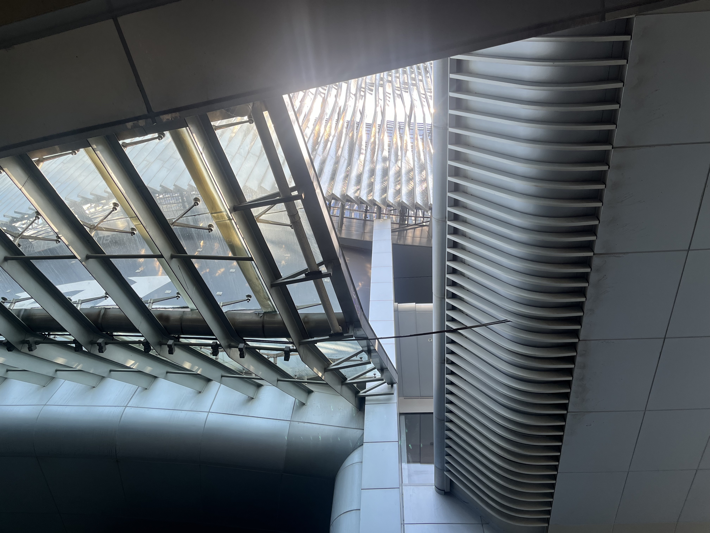

40度的夏天，在上海热化了🫠。
感谢上海朋友们的接待，私房菜好吃，菊花汽水也别有一番风味。
一起去做了手工，我快速成为卡林巴琴手。
去了猎人人广店，好耶（无照片但是和其他所有猎人完全一致）。

太热了，从虹桥站紧急跑路，路过了LPL的上海主场，地下视角的一张仰视图（下次来看比赛吧，好方便的地理位置）：

## 扬州

晚上才到扬州，必须去看看占去天下三分之二的月色。
夜游瘦西湖，如今可是成熟的旅游项目了。

沿着瘦西湖走，远远看到了疑似白塔的身影，不知此身何处？
因为实在太像北海白塔了，搜了一下，竟然真是仿造北海白塔所建。
还流传有野史故事说，乾隆下江南游玩到此，感慨此地太像京城北海的琼岛春阴，只可惜没有白塔，盐商为讨好皇帝贿赂皇帝左右得到图纸，一夜之间以盐包纸扎堆成。
虽然故事荒诞，但不吐不快，什么人到了扬州竟时时想着北京，真是一点不懂江南的好！

“古代文化与现代文明交相辉映的名城”，物换星移几度秋。

住在扬州迎宾馆，真是景色独好。
可以搭小车环游酒店和喂孔雀黑天鹅，冬天来了可以泡一泡温泉，甚至感觉有那么一点点适合长住。
但是我忘记拍照了，太阳照射下的老iphone实在是太烫了！！！
依此类推，逛老城区都忘记拍照了；不过老城区的时间流速慢，以后再来应是一致。

淮扬菜最最是此行重头戏。
除去点心的荤馅略有甜口，其他的点菜时就可以很好规避甜口的菜，比在北京吃淮扬菜安全多了。
扬州不是太贵的淮扬菜馆子，是土菜馆/本地菜馆的感觉，服务员也都脾气好好，很是亲切，下次想去淮安看看。
以前在北京吃不那么地道的淮扬菜，菜的卖相和价格都端着，而吃到嘴里的调味却甚粗犷；但又听有扬州人说，现在最好的淮扬菜都不在扬州（反正我也不知道在哪里），语气难免遗憾，大抵有老饕希望扬州的淮扬菜恢复往昔的精致做派；而我既见过了北京的淮扬菜，又吃了扬州的，好吃很多的，身在北京则想念扬州的市井淮扬菜，扬州本地人的想法或不同，现在是橘生淮北为枳，橘生淮南也未必是橘了。

看看我吃了些什么：

|豆腐|点心|肉|
|:-:|:-:|:-:|
|[gansi](gansi.jpg)|[feicuishaomai](feicuishaomai.jpg)|[laoe](laoe.jpg)|
|[wensi](wensi.jpg)|[shizitou](shizitou.jpg)|[shan](shan.jpg)|

## 南京

