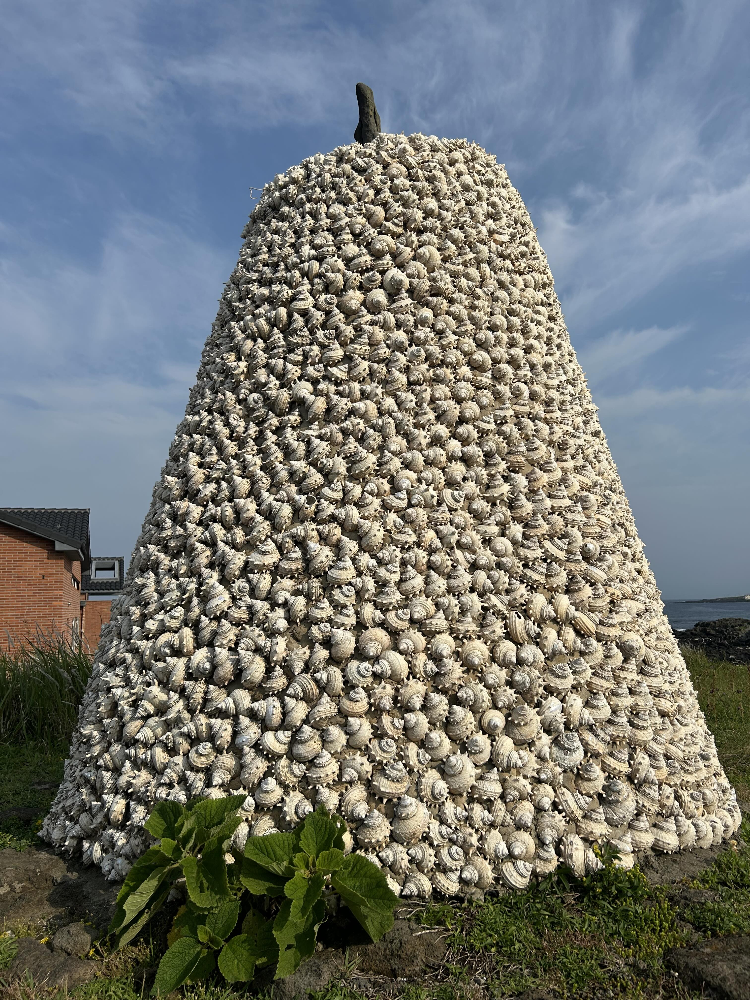

最后的毕业旅行❤️

## 济州岛

阳光下，济州岛的水一片明亮的蓝色绿色：



尽管是六月份，下水游泳还是挺冷骨头的。
海水浴场周围可见出租冲浪设备的店铺，但是全都没有开门，看来确实还没有到玩水的季节。
倒是有快艇可以出海玩，主要内容仿佛是快艇版本的特技表演，不过我好歹是经历过悉尼观鲸的大风大浪的人。

|惊涛拍岸|Cthulhu in the Shell|
|:-:|:-:|
|||

济州岛最有趣的部分是复杂的地质条件，汉拿山火山喷发之后的熔岩流入海里，冷却形成了柱状节理带。
黑色的密集排列的六角柱看上去很不天然，很适合末世片取景--海水变成红色，拍打在黑色的石壁上...

济州岛随处可见一种怪异的石头老头雕像。
有一种说法是，石头爷爷是元朝统治时期流传下来的形象，倒是确有几分相似。
一个酒店门口的金色版本：



## 首尔

2025年6月，我们在参观青瓦台的时候，已然知道同月已公布8月1日即将停止对公众开放。
莫名感慨，也许我们成为一段反复无常的历史的一部分。



青瓦台最有趣的部分是一个装饰有韩国历任总统油画的房间。
很好奇每一任总统坐在这个房间里，会想到些什么。
青瓦台甚至还有售卖官方周边的纪念品店，不过店门口大排长龙，想来大家喜闻乐见的纪念品也不会出现在这里我便掉头走了。

从青瓦台出来，尝试了看上去比较地道的传统韩餐。
吃得我们晚上去吃了韩式中餐。
（比美式中餐强太多）