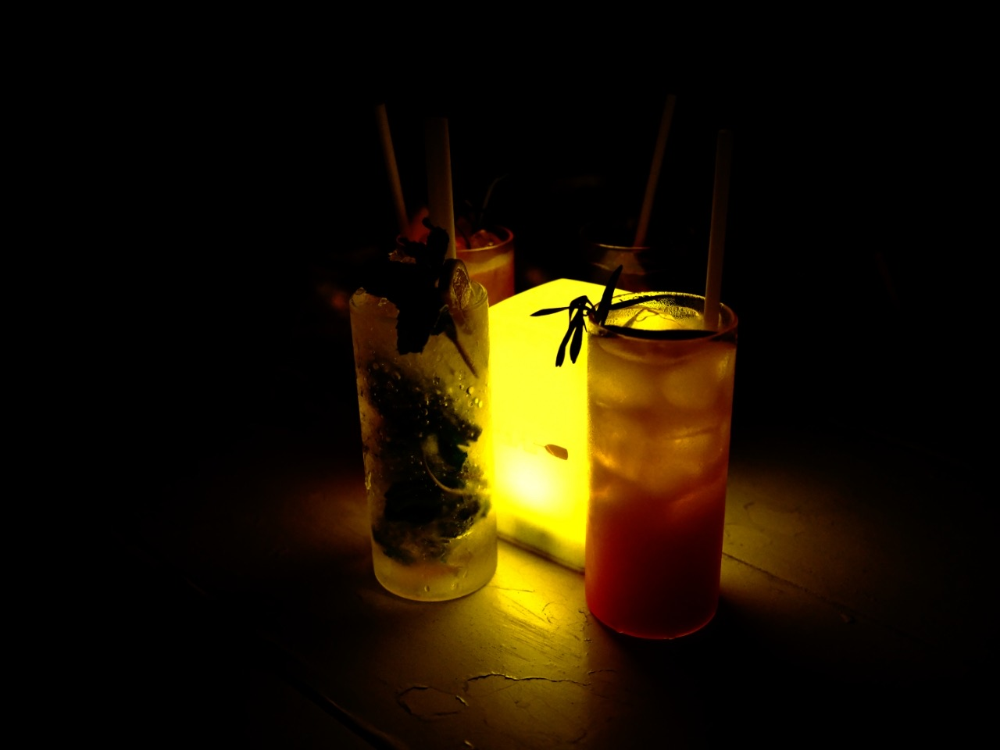

没错，棒垒队的团建已经进化到去三亚学冲浪了。
甚至为了看北大杯决赛进行了一个两天的rush行程...

放送几张我还挺喜欢的风景（好看的都不是我拍的，感谢同行的朋友们）。

云层里的日出：

星空：

椰林：

酒店：

酒店大堂：

海滩上的烟花：

酒吧：

沙滩和倒影：

虽然冲浪很好，但是早起很痛苦。
许愿下次冲浪可以睡到自然醒！
