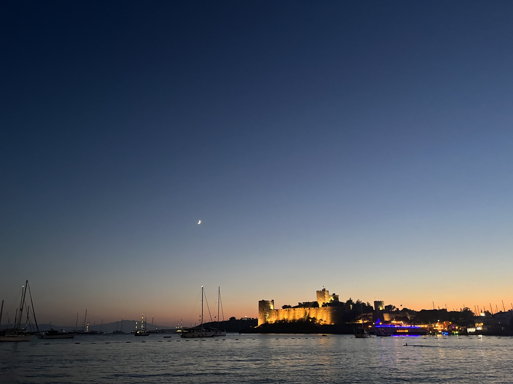
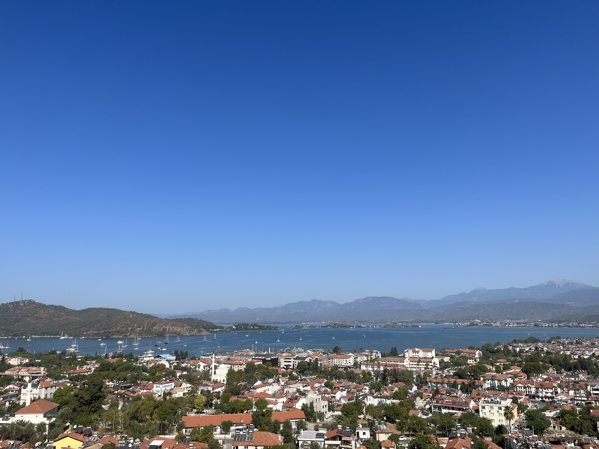
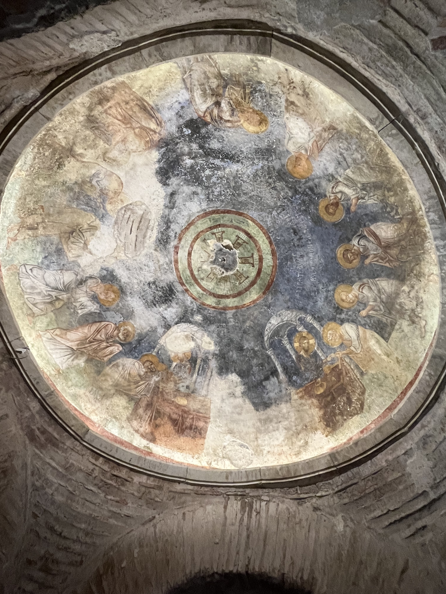
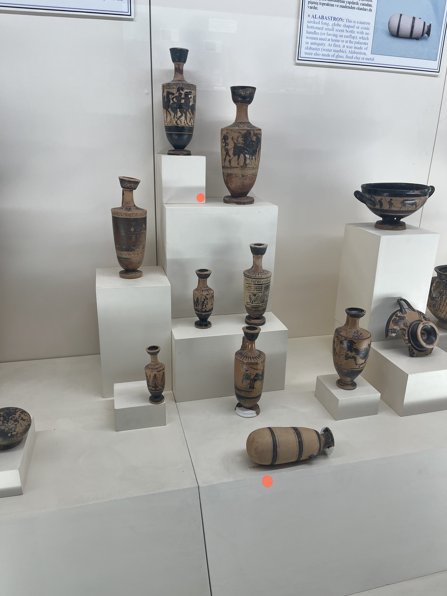
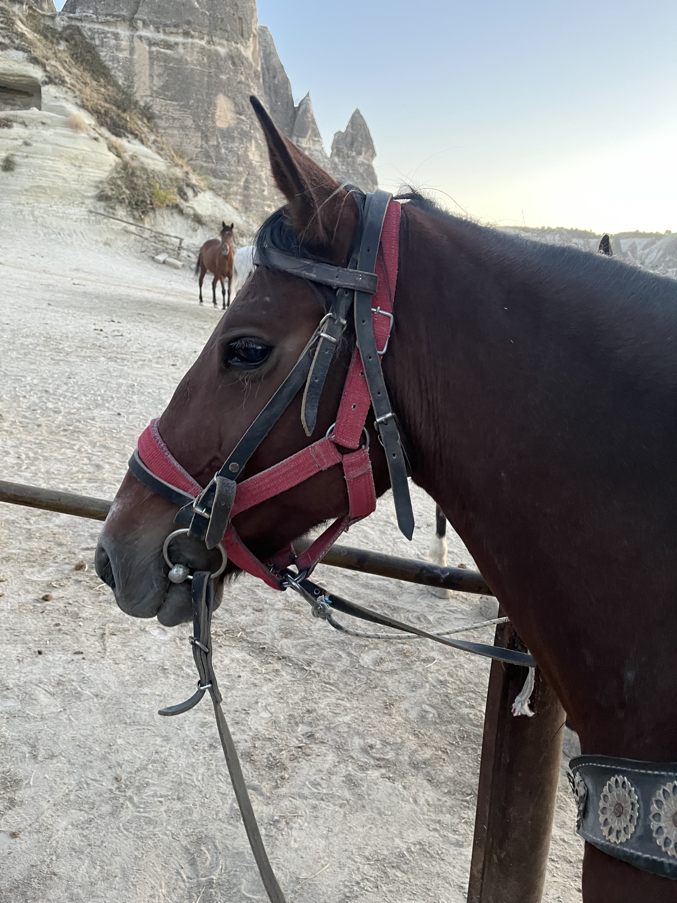
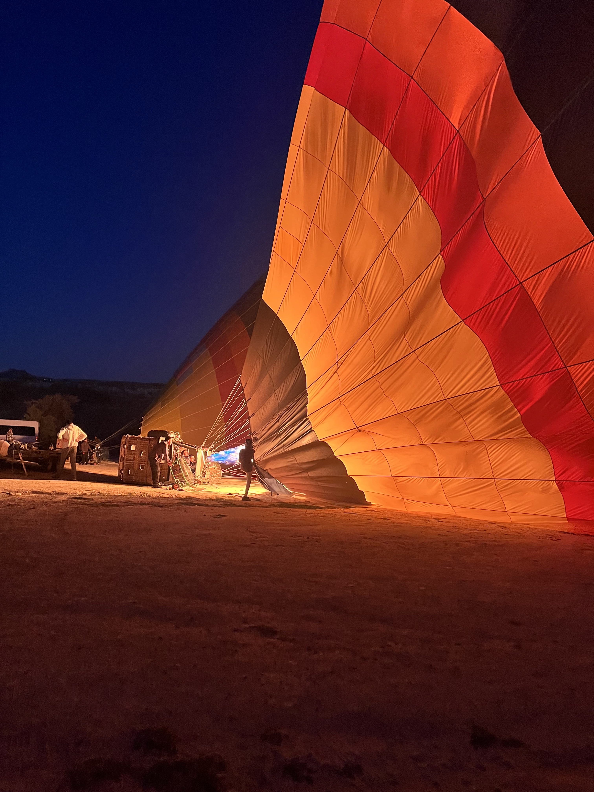
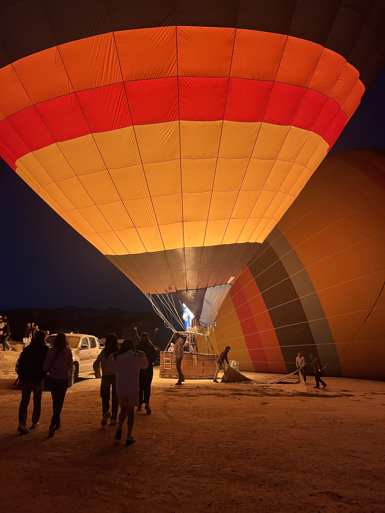
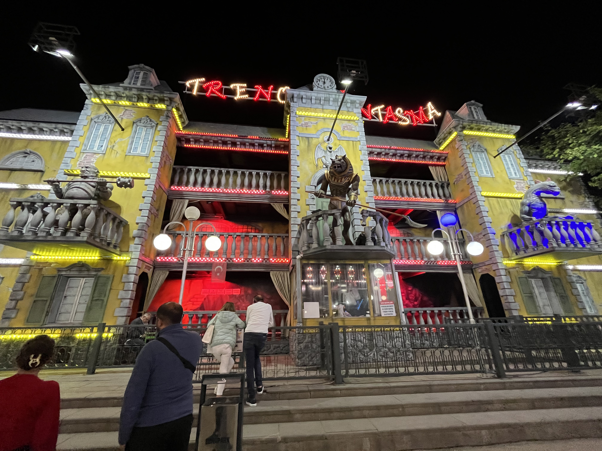
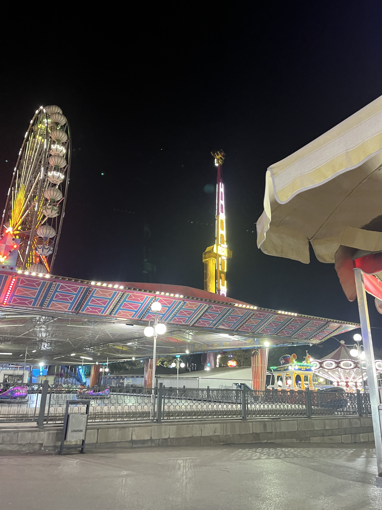
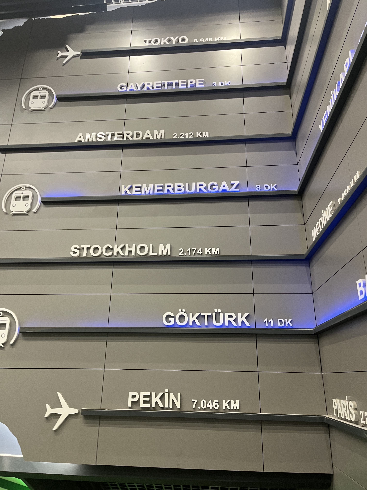

大四的时候，和当时的室友们说好一起去土耳其毕业旅行。
新冠把一切计划都打乱了。
三年过去，只有我还留在北大读博。
欣漪正好今年硕士毕业，祝贺她迎来人生的新阶段。

迟到三年的毕业旅行。

## Istanbul

圣索菲亚大清真寺：

 

|        Outside | Inside |
|:-------------------------:|:-------------------------:|
|   |   |

此行最最最最重要的目的地之一，目前重新改为清真寺，被称为Aya Sofya。
博物馆时期是要门票的，目前是游客可以在一天中一半的时间自由进入。
从蓝色清真寺出来，远远地看到粉色的外墙，仿佛身处北非。
惟一的大教堂时代痕迹是造型奇怪的六翼天使。

再来一张从博斯普鲁斯海峡远眺视角（能找到吗；渡轮真美好）：

伊斯坦布尔的博物馆实在是太多太多！
恨不得把照片都放上来，但是还是请参见 [MuseumPass](https://muze.gen.tr/MuseumPasses)。
两个苏丹皇宫都十分推荐，真真是目不暇接，看完之后都没有其他世俗的欲望了。
附送从Galata Tower拍摄的伊斯坦布尔夜景（iPhone的夜景模式和我的摄影水平很难说谁更拉）：

| Asia | Europe |
|:-:|:-:|
| |  |

亚洲侧（伊斯坦布尔）；欧洲侧（康斯坦丁尼耶）。

关于食物，红茶好喝，土耳其咖啡好喝，kebab好香，水烟好香，石榴汁可怕。

## Izmir

坐了低空飞行的飞机到Izmir，爱琴海边。
海边有通勤小火车，可以从城市南坐到城市北。

古罗马文明城市：

没错我不是胡编，这有块碑文的翻译就是说自己在罗马内部成为了（？）文明城市。
这是市政厅（Agora）的-1层，是它的商业市场，地下巴扎？
这个泉水疑似是商业市场的自来水。
实在是太发达了，精罗程度50%。

附送我超级喜欢的标志，土耳其的标志都画的好动感啊：

## Selçuk

Selçuk有土耳其最负盛名的遗址Ephesus。

我刘姥姥进了大观园：

这是Ephesus的大剧场，每个走进Ephesus的人，第一眼都会被它吸引住，真是宏伟啊！
从剧院往下看，能看到当时通向海边码头的大道，也是十分宏伟。
我从未见过如此宏伟的城市，精罗程度100%。

Ephesus还有雕梁画栋的图书馆，以及现在看不太出来的大浴场。

## Bodrum

从Selçuk赶到Bodrum的路程，是我迄今旅程中最奇异的。
我要是以自己为主角写传奇故事，这一天应该是大战风车级别的吧（以后再写）。

不知道什么原因，上上站爱琴海边的Izmir的海水一点也不蓝。
到了Bodrum，终于看到了清澈的美丽的渐变的海水。
海滨度假，启动。

晚上在海边吃饭很惬意，附送一张黄昏下海边的城堡：

## Pamukkale

棉花堡，很早以前就是各种地理杂志的常客。
地理杂志上的样子是层层叠叠的白色钙化池上浅蓝的水，一种蓝白色梯田的感觉。

实际上，有一个很大的古罗马城市，这个城市城门外的洗澡处（进入城市需要净化自己）甚至都很宏伟。
大概是因为棉花堡很早就是古罗马内部的温泉疗养圣地？

并且，蓝白色梯田好像已经枯水了，再也看不到地理杂志照片那样的风景了，可惜。

不过有一个可爱的小博物馆，里面有很多一眼克苏鲁的真古希腊雕塑。

因为我没有看到地理杂志般的风景，请看客移步地理杂志。

## Fethiye & Kas

又回到了美丽的地中海畔。

海滩，游泳。
成为了小海滩上惟一不会自由泳的菜狗。

欣赏一下梦幻的海水。

## Demre

圣尼古拉斯教堂（圣诞老人原型）。

传说圣尼古拉斯因能治愈疾病而闻名，因此他的圣遗骸遭盗墓贼的觊觎而被多次盗走...

教堂有很多壁画，可惜我没有上过宗教学导论？
这里是东正教的圣地，因此几乎全是俄罗斯游客。

附送我很喜欢的o型嘴雕塑：

## Antalya

在Antalya中转，逛了一下博物馆，有很可爱的陶器：

和欣漪疯狂讨论，为什么现在没有复刻博物馆原款在贩，这些陶器，还有君堡的银器，这就是当古罗马公民的快乐吗。
Antalya附近有一个古罗马田径场（？）遗迹，这次错过了，希望还有机会去看看，达成精罗150%。

## Goreme

小时候的诺基亚手机，开机动画是一堆热气球升起，现在回忆起来觉得应该就是Goreme了吧。

第一天没事干去报了当地的骑马游。
附上结束了一天的工作（驮着我走来走去）看都不想再看我一眼的马儿：

对不起，以后要做动物保护者。

本来以为热气球没有什么意思，但是真的很好玩！

点火中的热气球：

| Firing | and Firing |
|:-:|:-:|
|||

太阳逐渐升起，山谷里处处都是热气球：

虽然早起是极致折磨，但是这次日出真的很美好。

## Ankara

在返回君堡的途中，在Ankara逛了一天。
Ankara虽然是土耳其首都，但是感觉更为保守而且不算是著名的旅游目的地。
像本地人一样闲逛，被夜晚中最闪亮亮的游乐设施吸引到了一个奇怪的公园：

| Ghost House | ??? |
| :-: | :-: |
|  | |

有室外部分的鬼屋，以及两边绑人的摆臂，虽然看上去破破烂烂但是真的很新奇，欢乐谷，能不能看一眼这个。

## postscript

最后一天和欣漪去吃了土耳其老甜点做早餐，又香又腻（？），还买了后来差点甜死很多人的baklava伴手礼。
很不舍地分别，先行一天去坐飞机。
刚到机场就下起了大大大大大暴雨。
坐在飞机上等待起飞，因为等得太久，飞机又滑回去加油了，第一次遇到这种情况。
最后在焦虑不安的等待中，居然先把飞机餐发了，只能焦虑不安地吃饭，这样会消化不良的吧。
当时真的有一种，想要跳下飞机多在君堡呆几天的冲动。

