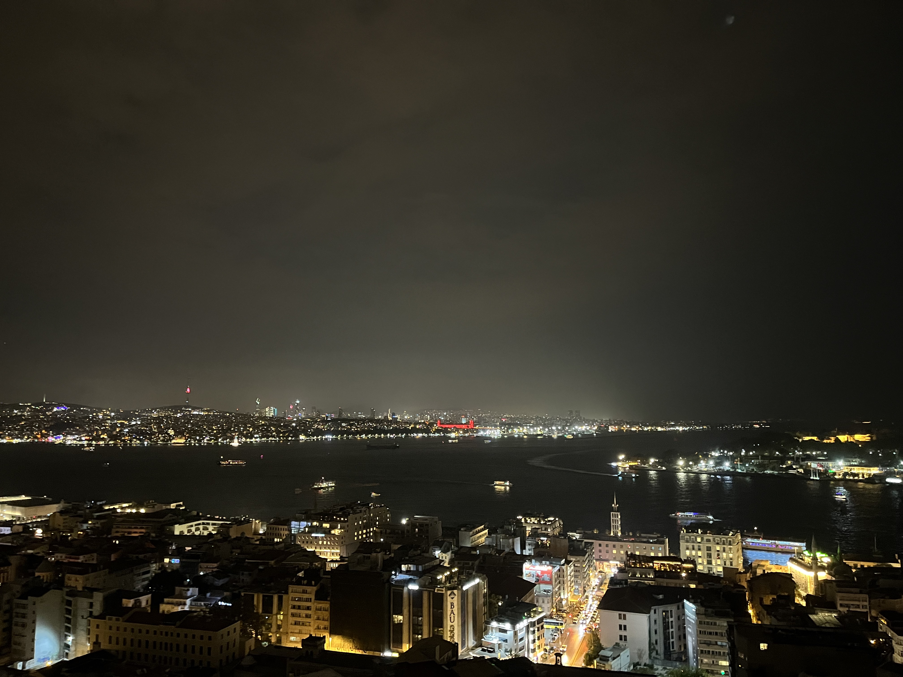
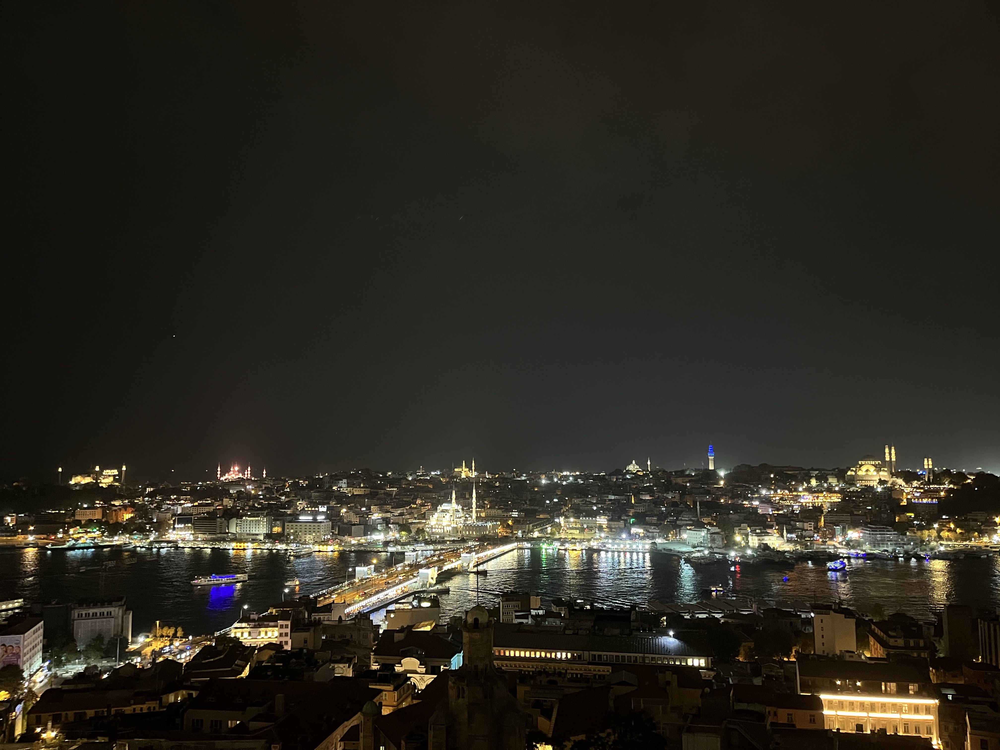
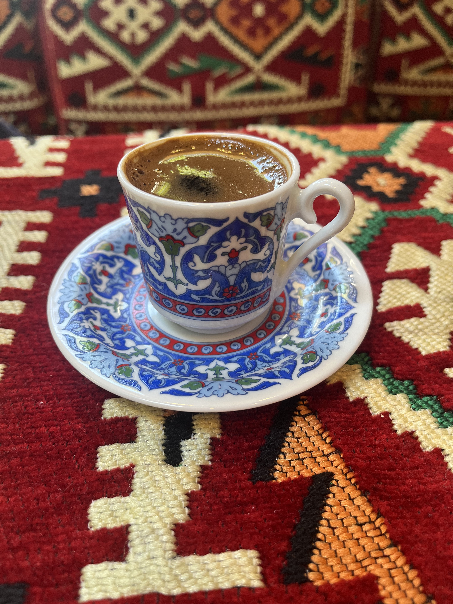

大四的时候，和当时的室友们说好一起去土耳其毕业旅行。
新冠把一切计划都打乱了。
三年过去，只有我还留在北大读博。
欣漪正好今年硕士毕业，祝贺她迎来人生的新阶段。

迟到三年的毕业旅行。

## Istanbul

圣索菲亚大清真寺：

 

|        Outside | Inside |
|:-------------------------:|:-------------------------:|
|   |   |

此行最最最最重要的目的地之一，目前重新改为清真寺，被称为Aya Sofya。
博物馆时期是要门票的，目前是游客可以在一天中一半的时间自由进入。
从蓝色清真寺出来，远远地看到粉色的外墙，仿佛身处北非。
惟一的大教堂时代痕迹是造型奇怪的六翼天使。

再来一张从博斯普鲁斯海峡远眺视角（能找到吗）：

伊斯坦布尔的博物馆实在是太多太多！
恨不得把照片都放上来，但是还是请参见 [MuseumPass](https://muze.gen.tr/MuseumPasses)。
附送从Galata Tower拍摄的伊斯坦布尔夜景（iPhone的夜景模式和我的摄影水平很难说谁更拉）：

| Asia | Europe |
|:-:|:-:|
| |  |

亚洲侧（伊斯坦布尔）；欧洲侧（康斯坦丁尼耶）。

关于食物，红茶好喝，土耳其咖啡好喝，kebab好香，水烟好香，石榴汁可怕。

## Izmir

坐了低空飞行的飞机到Izmir，爱琴海边。

古罗马文明城市：

没错我不是胡编，这有块碑文的翻译就是说自己在罗马内部成为了（？）文明城市。
这是市政厅（Agora）的-1层，是它的商业市场，地下巴扎？
这个泉水疑似是商业市场的自来水。
实在是太发达了，精罗程度50%。

附送我超级喜欢的标志，土耳其的标志都画的好动感啊：

## Selçuk

Selçuk有土耳其最负盛名的遗址Ephesus。

我刘姥姥进了大观园：

这是Ephesus的大剧场，每个走进Ephesus的人，第一眼都会被它吸引住，真是宏伟啊！
从剧院往下看，能看到当时通向海边码头的大道，也是十分宏伟。
我从未见过如此宏伟的城市，精罗程度100%。

Ephesus还有雕梁画栋的图书馆，以及现在看不太出来的大浴场。

## Bodrum

## Pamukkale

## Fethiye

## Kas

## Demre

## Antalya

## Goreme

## Ankara

